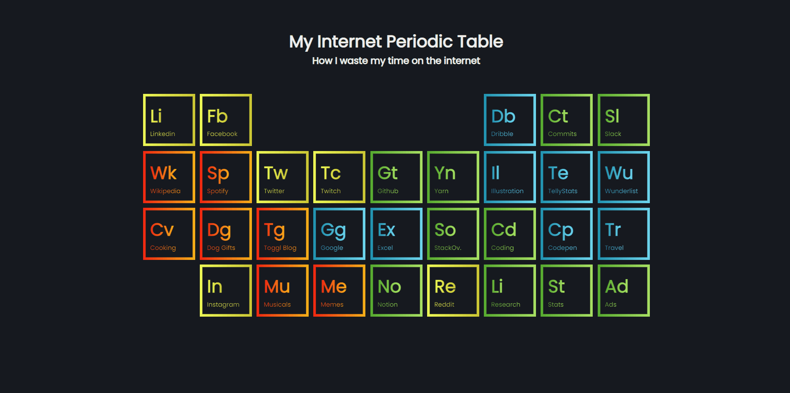

# Internet Periodic Table

Funny design I found on the internet that I used to apply/study CSS Grid. Creator credited at the bottom.

## Tech Stack

HTML and SASS.

## Live Demo

https://pedroenriquedev.github.io/Periodic-table/

#### Showcase

## Installation

Simply clone the repo and run the html file on the browser. If you wish to make any changes to the scss file, install a SASS compiler on the code editor of your preference.

## Credits

Design was found at https://codepen.io/oliviale/pen/ZmvPPd.

## Support

For support, please email pedroenriquedev@gmail.com.
